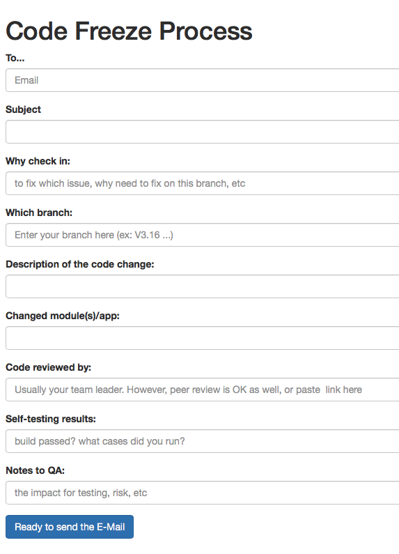

# sender
<a href="//binghuan.github.io/sender/" target="_blank">binghuan.github.io/sender/</a>

This is used to create mail body used to send code freeze unlock information, 
After completing, press the button will link mail app for sending mail, 
This is a convenient way to send a mail in format. 
Features:  
- Just fill the necessary information to send a notification.

